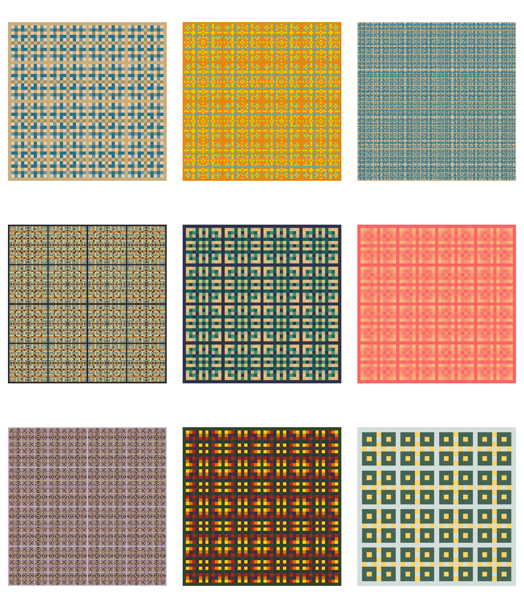

I was reading about the [Hidden beauty of multiplication tables](https://plus.maths.org/content/hidden-beauty-multiplication-tables) and I thought it could be fun to make some of the cool plots in that article with R. While we are at it, we can tweak some of them and play around with the tables to see what we get.

## The multiplication table

Consider the standard $10 \times 10$ multiplication table, with the first row and the first column taking the values $1$ through $10$, forming a grid with the corresponding products.
```{r, message = FALSE}
library(tidyverse)

# Data frame with all the values of the 10x10 multiplication table
multiplication_table <- tibble(
    x = 1:10,
    y = 1:10
) %>% # Get all combination of x and y
    complete(x, y) %>% # Get the product of all combinations
    mutate(product = x * y)

ggplot(multiplication_table, aes(x, y)) +
    geom_tile(color = "white") +
    geom_text(aes(label = product), color = "white") +
    # We want the table to start with 1 in the upper-left corner
    scale_y_continuous(trans = "reverse") +
    # We want to always display the tables as squares
    coord_fixed() +
    theme_void()
```


For purposes that we will see next, I am going to add a row and a column of zeros above and to the left of our table, respectively:
```{r}
multiplication_table <- tibble(
    x = 0:10,
    y = 0:10
) %>% 
    complete(x, y) %>% 
    mutate(product = x * y)
ggplot(multiplication_table, aes(x, y)) +
    geom_tile(color = "white") +
    geom_text(aes(label = product), color = "white") +
    scale_y_continuous(trans = "reverse") +
    coord_fixed() +
    theme_void()
```


Next, we will discover some beautiful symmetries by coloring the rectangles of the multiplication table that correspond to multiples of a number $k$ for various values of $k$.

## Single multiples

We say that $c$ is a multiple of $k$ if $c = n k$ for some integer $n$, which is called the multiplier. So we can tell if a given number $c$ is a multiple of $k$ if the division $c$ over $k$ has remainder 0.

Let's begin with $k = 2$. I am going to color the cells corresponding to multiples of $2$ in one color and non-multiples of $2$ in another color. Check out the pattern it emerges:
```{r}
library(wesanderson)
m2 <- multiplication_table %>% 
    mutate(multiple_of_2 = product %% 2 == 0)
# Color palette chosen from the wesanderson package
colors <- wes_palette(name = "Zissou1", n = 2)
ggplot(m2, aes(x, y)) +
    geom_tile(aes(fill = multiple_of_2), color = "white") +
    geom_text(aes(label = product), color = "white") +
    scale_y_continuous(trans = "reverse") +
    coord_fixed() +
    scale_fill_manual(values = colors,
                      name = "Multiple of 2?",
                      labels = c("No", "Yes")) +
    theme_void()
```


If we look closely we can see that the whole pattern above can be pieced together using the following fundamental block:
```{r, fig.height = 2, fig.width = 2}
block_2 <- tibble(
    x = c(0,1),
    y = c(0,1)
) %>% 
    complete(x, y) %>% 
    distinct() %>% 
    mutate(product = x * y,
           multiple = product %% 2 == 0)
ggplot(block_2, aes(x, y)) +
    geom_tile(aes(fill = multiple), color = "white") +
    scale_y_continuous(trans = "reverse") +
    scale_fill_manual(values = colors,
                      guide = FALSE) +
    theme_void()
```

As Zoheir Barka explains in his article mentioned at the beginning, the fundamental building block contains $k \times k = 2 \times 2 = 4$ cells of the multiplication table. The fact that, in the case of a single multiple, each side of the fundamental building block is $k$ can be useful when plotting our tables.

We want to explore the patterns for different values of $k$ so I created a simple function that plots a colored multiplication table for the supplied $k$ and the supplied dimensions. Multiples and non-multiples are colored the same way as before so I chose to drop the legend for aesthetic reasons. I will add more arguments to this function later to easily customize the resulting table.

```{r}
# Auxiliary function to create a data frame 
# with the values of the multiplication table
create_mtable <- function(xmax, ymax) {
    data.frame(
        x = 0:xmax,
        y = 0:ymax
    ) %>% 
        complete(x, y) %>% 
        mutate(product = x * y)
}

# Plot the colored table
draw_pattern <- function(k, xmax, ymax) {
    # Colors chosen from the Zissou1 palette in the wesanderson package
    colors <- wesanderson::wes_palette(name = "Zissou1", n = 2)
    tab <- create_mtable(xmax, ymax) %>% 
        mutate(multiple = product %% k == 0) %>% 
        ggplot(aes(x, y)) +
        geom_tile(aes(fill = multiple), color = "white") +
        geom_text(aes(label = product), color = "white") +
        scale_y_continuous(trans = "reverse") +
        coord_fixed() +
        scale_fill_manual(values = colors) +
        theme_void() +
        guides(fill = FALSE)
    tab
}
```

We can now easily plot the colored tables for different values of $k$ and see what patterns emerge:
```{r, fig.height=5, fig.width=5}
draw_pattern(k = 4, xmax = 4 * 3, ymax = 4 * 3) +
    labs(title = "Multiples of 4")
draw_pattern(6, 6 * 2, 6 * 2) +
    labs(title = "Multiples of 6")
```


Notice that we set the "length" of each side of the tables to multiples of $k$ so that the pattern is symmetric.

## Multiple multiples

We can plot more interesting (and beautiful) patterns if we use multiple multiples, and corresponding to them, multiple colors.

Consider the multiples of $k_1 = 2$ and $k_2 = 3$. I will color each square of the multiplication table according to the following criteria:

* Not multiple of neither 2 nor 3

* Multiple only of 2

* Multiple only of 3

* Multiple of both 2 and 3

```{r}
multiple_multiples <- tibble(
    x = 0:12,
    y = 0:12
) %>% 
    complete(x, y) %>% 
    mutate(product = x * y,
           m2 = product %% 2 == 0,
           m3 = product %% 3 == 0,
           inter = interaction(m2, m3)) %>% 
    mutate(interaction = recode_factor(inter,
                                       FALSE.FALSE = "Multple of neither",
                                       TRUE.FALSE = "Multiple of 2",
                                       FALSE.TRUE = "Multiple of 3",
                                       TRUE.TRUE = "Multiple of both"))
ggplot(multiple_multiples, aes(x, y)) +
    geom_tile(aes(fill = interaction), color = "white") +
    geom_text(aes(label = product), color = "white") +
    scale_fill_brewer(palette = "Pastel1",
                      name = element_blank()) +
    scale_y_continuous(trans = "reverse") +
    coord_fixed() +
    theme_void()
```

Notice that I used a $12 \times 12$ table so that I got a symmetric pattern. I did this because I knew that the fundamental building block is given by the least common multiple of $2$ and $3$. That is, in this case the fundamental block consists of $6 \times 6 = 36$ little cells.


## multable package

I have created a simple R package out of this idea of coloring the factors of different numbers, called `multable`. You can install it with
```{r, eval = FALSE}
# install.packages("devtools")
devtools::install_github("solmos/multable")
```

As of now, the package contains just two functions:

* `create_table()` generates a data frame with the grid values and identifies the factors for different values of `k`

* `draw_pattern()` plots the multiplication table coloring the different cells according to what value of `k` a given cell is a factor of

Check out the code for these functions [here](https://github.com/solmos/multable). My plan is to add more functionality to this package but you can actually do some pretty cool visualizations as it is.




