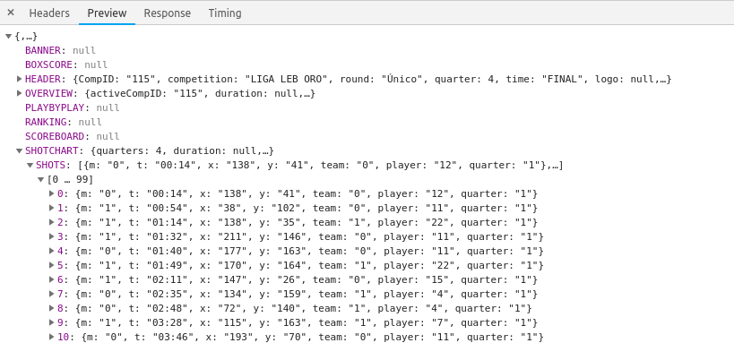

[Kirk Goldsberry](https://twitter.com/kirkgoldsberry) es una de las figuras más destacadas en el mundo de la estadística avanzada en la NBA. Se le conoce principalmente por el uso de gráficos de tiro en sus análisis. Este es un ejemplo en el que se muestran todos los tiros que ha realizado Lebron James a lo largo de su carrera:


Los gráficos de tiro (*shot charts* en inglés) pueden ser útiles para, por ejemplo, identificar tendencias en ataque de un determinado jugador/equipo, mostrar en qué zonas del campo un jugador es más efectivo o analizar qué tipo de tiros un equipo permite al rival.

En esta entrada voy a crear un gráfico de tiro de un partido de la liga en la que yo juego, la [Leb Oro](http://www.leboro.es/inicio.aspx). Específicamente, voy a utilizar el partido que disputé con mi equipo, el Covirán Granada, contra mi ex-equipo, el Leyma Coruña.

## 1. Obtener los datos

Cada jornada, en la plataforma de [Baloncesto en Vivo](http://baloncestoenvivo.feb.es/) podemos seguir la evolución de las estadísticas de los partidos en directo. En esta plataforma no sólo se puede ver la tabla de estadísticas a la que estamos acostumbrados, también es posible ver las estadísticas jugada a jugada o los gráficos de tiro.

Sin embargo, **la página web de la FEB no lo pone muy fácil a la hora de acceder a estos datos**. Baloncesto en Vivo no proporciona menús de selección de ningún tipo que nos permitan elegir partidos de jornadas (o temporadas) anteriores. En la página principal tan solo aparecen los partidos de la jornada vigente en ese momento.

A simple vista parece que cada jornada se eliminen los datos de la jornada anterior. No es así. Las páginas siguen siendo accesibles, aunque solo si has apuntado la dirección web cuando estaba visible en su momento ¯\\\_(ツ)\_/¯.

En este caso el enlace al partido que utilizaré en esta entrada es el siguiente:

http://baloncestoenvivo.feb.es/Game/2010150

Básicamente, debemos encontrar qué enlace o solicitud a la API nos da la información que queremos. Soy relativamente nuevo en esto de extraer datos de la web por lo que no entraré en mucho detalle de cómo lo he hecho. Esta entrada de [Greg Reda](http://www.gregreda.com/2015/02/15/web-scraping-finding-the-api/) me ha sido de gran utilidad.

Para encontrar esta solicitud a la API utilizaremos las herramientas para desarrolladores de nuestro navegador (en mi caso Chrome). Estando en la pestaña del [gráfico de tiro](http://baloncestoenvivo.feb.es/Game/2010150#shotchart), estos son los pasos que seguí para dar con el *request*:

1. Abrimos las herramientas para desarrolladores de nuestro navegador

2. Vamos a la pestaña de *Network*

3. Seleccionamos el filtro `XHR`

4. Refrescamos la página

5. Seleccionamos la entrada `20100150`

6. En la pestaña *Preview*, podemos observar que las coordenadas de los tiros se encuentran bajo la etiqueta `SHOTS` dentro de `SHOTCHART`




7. En la pestaña *Headers* copiamos el enlace de la petición bajo el título `Request URL`: http://baloncestoenvivo.feb.es/api/ShotChart/2010150

Ya tenemos el enlace de la petición que nos dará la información que queremos. Para realizar la petición utilizaremos el paquete de R `httr`. También utilizaremos el paquete `jsonlite` para, una vez descargados los datos en formato JSON, obtener un objeto `list` con toda la información en un formato mucho más fácil de manipular en R. Ya que estamos, también cargamos el paquete `tidyverse`, que utilizaremos para manipular estos datos.

```{r, message=FALSE, warning=FALSE}
library(httr)
library(jsonlite)
library(tidyverse)

api_request <- GET("http://baloncestoenvivo.feb.es/api/ShotChart/2010150")
content_list <- content(api_request, as = "text", encoding = "UTF-8") %>%
    fromJSON
```

El objeto `content_list` es una lista con 10 elementos. La estructura de esta lista es precisamente la estructura que observamos cuando estábamos buscando el enlace de petición de la API.

```{r}
shotchart_raw <- content_list$SHOTCHART$SHOTS %>%
    as.tibble() %>% 
    print()
```

Y aquí lo tenemos, un simple *data frame* con los datos que queríamos. Si miramos la ficha de estadísticas del partido, podemos comprobar que se hicieron 128 tiros entre los dos equipos, exactamente el número de filas en nuestra tabla de datos.

Podemos deducir fácilmente qué representa cada variable:

* `m` = Fallo (0) o acierto (1)

* `t` = Tiempo

* `x` = Coordenada en el eje horizontal

* `y` = Coordenada en el eje vertical

* `team` = Equipo al que pertenece el jugador realizando el tiro (0 equipo de casa, 1 equipo visitante)

* `player` = Dorsal del jugador que realiza el tiro

* `quarter` = Cuarto del partido en el que se realizó el tiro

Observamos que todas la variables en nuestro data frame son de tipo `character`. Modificamos la clase de cada variable en base a lo que representa:
```{r}
shotchart_df <- shotchart_raw %>%
    transmute(made = as.factor(m),
              time = parse_time(t, "%M:%S"),
              x = as.numeric(x),
              y = as.numeric(y),
              team = factor(team, labels = c("Granada", "Coruña")),
              player = as.factor(player),
              quarter = as.factor(quarter))
shotchart_df
```

Vamos a visualizar los tiros según sus coordenadas:
```{r}
ggplot(shotchart_df, aes(x, y)) +
    geom_point(aes(color = team, shape = made)) +
    theme_minimal()
```


## 2. Dibujar la cancha

En el gráfico de arriba nos falta dibujar las líneas que delimitan la cancha de juego. En concreto, vamos a dibujar media pista con el aro en la parte inferior. Al parecer, la plataforma Baloncesto en Vivo apunta la localización de los tiros en base a la antigua línea de triple a 6.25 metros, así como la antigua zona, : confused : .

El siguiente bloque de código utiliza `ggplot2` y la extensión `ggforce` para dibujar la pista de baloncesto con [estas medidas](http://www.csd.gob.es/csd/estaticos/inst-dep/nide/campos-peq/reglamentarias/baloncesto/blc1_el_campo_de_juego.pdf):
```{r}
library(ggforce)  ## For geom_circle() and geom_arc()

outer_edges <- tribble(
    ~x,    ~y,
     0,    0,
     0,    1400,
     1500, 1400,
     1500, 0,
     0,    0
)
mid_x <- 15 / 2
paint_rectangle <- tribble(
    ~x,           ~y,
    750 - 175,     0,
    750 - 175,     580,
    750 + 175,     580,
    750 + 175,     0
)

court <- ggplot() +
    
    # Outer edges
    geom_path(aes(x, y), data = outer_edges) +
    
    # Free throw circle
    geom_circle(aes(x0 = 750, y0 = 580, r = 175)) +
    
    # Paint rectangle
    geom_path(aes(x, y), data = paint_rectangle) +
    
    # Three point arc
    ## Top arc
    geom_arc(aes(x0 = 750, y0 = 157.5, r = 625,
                 start = pi / 2, end = - pi / 2)) +
    ## Corner lines
    geom_path(aes(c(125, 125), c(157.5, 0))) +
    geom_path(aes(c(1500 - 125, 1500 - 125), c(157.5, 0))) +
    
    # Basket
    ## Rim
    geom_circle(aes(x0 = 750, y0 = 120 + 45, r = 22.5)) +
    ## Backboard
    geom_path(aes(x = c(750 - 90, 750 + 90),
                  y = c(120, 120))) +
    coord_fixed()

court
```

## Crear el gráfico de tiro

Ahora debemos sobreponer los puntos que representan los tiros en la pista que hemos dibujado. Sin embargo, vemos que **las escalas son diferentes**: 
```{r}
court + geom_point(data = shotchart_df, aes(x, y, color = made))
```


Deberemos transformar los valores de las coordenadas de los tiros para que se ajusten a la pista que hemos dibujado. Esto es, debemos encontrar un valor $c$ tal que multiplicándolo por el valor de las coordenadas obtengamos valores en la escala de nuestra pista.

**No he encontrado una solución fácil a este problema**. Una opción es ir probando diferentes valores y ver qué valor nos da un resultado razonable. En una posible segunda entrada intentaré aportar una mejor solución.

***

Otra opción más formal es elegir $c$ de modo que el producto entre éste y el mayor valor de la coordenada en el eje horizontal $x_{max}$, quede dentro de la pista, esto es, elegir $c$ tal que $c x_{max} < 1500$. Podemos fijar un valor $d$ de modo que $c x_{max}$ no quede demasiado

$$c x_{max} = 1500 - d,$$

donde $c$ es el valor por el que multiplicaremos las coordenad

podemos elegir el valor los valores de las coordenadas por la siguiente cantidad

$$\frac{1500 - e} {max (x)}$$

***

```{r}
shots <- shotchart_df %>% 
    mutate(x = x * 5.45,
           y = y * 5.45,
           x_flipped = 2 * 750 - x)
court +
    geom_point(aes(x_flipped, y, color = made), data = shots)
```

```{r}
max_x <- max(shotchart_df$x)
trns <- (1500 - 25) / max_x
shots <- shotchart_df %>% 
    mutate(x = x * trns,
           y = y * trns,
           x_flipped = 2 * 750 - x)
court +
    geom_point(aes(x_flipped, y, color = made), data = shots) +
    geom_text(aes(x_flipped, y, label = time), size = 4, data = shots)
```

```{r}
court +
    geom_point(aes(x_flipped, y, color = made), data = shots)
```

