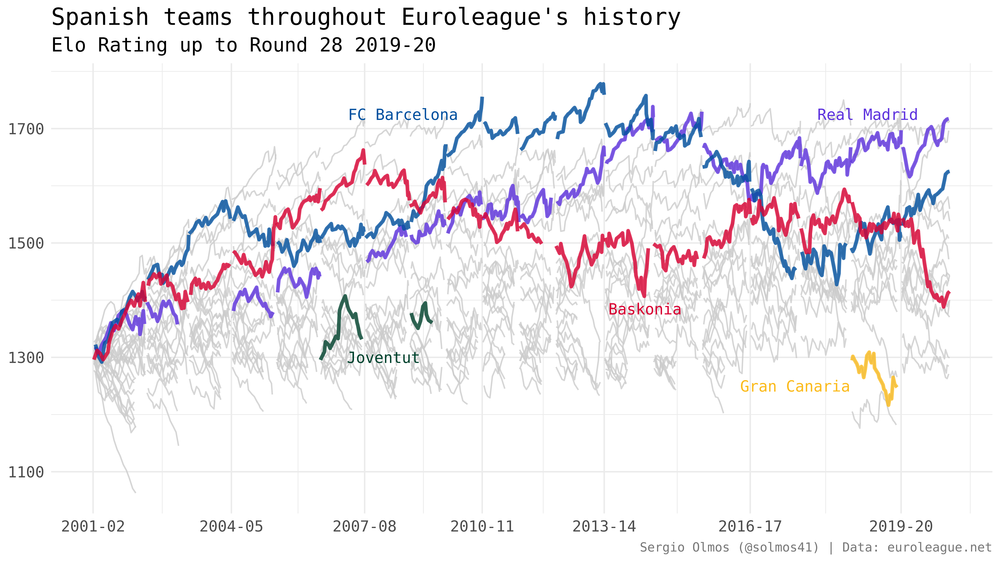

```{r setup, include=FALSE}
knitr::opts_chunk$set(echo = FALSE, message = FALSE, warning = FALSE)
library(eurolig)
library(tidyverse)
```


The other day I started building a [win probability model](https://en.wikipedia.org/wiki/Win_probability) for the Euroleague but soon I stumped into a little problem. This kind of model uses a set of covariates to predict a team's probability of winning as the game progresses. One of these covariates is usually some kind of indicator of how good or bad a given team is before starting the game. Many of these models use betting spreads from betting companies as the indicator. Some others use some kind of rating system that assigns a numeric value to each team based on its performance.

I needed to obtain some indicator of this type for all games played in Eurolegue since 2001. Instead of getting my hands dirty scraping the data from the HTML code of betting websites, I decided to build an Elo rating system for the Euroleague, which seems more fun and can be interesting in itself.


## Elo rating system

The [Elo rating system](https://en.wikipedia.org/wiki/Elo_rating_system) is a simple method to estimate the relative ability of players or teams in zero-sum games. This method was invented as a ranking system for chess players, but was later used in many sports such as soccer, football, basketball or Scrabble.

The basic ideas behind an Elo rating system are:

* A team's (Elo) rating is updated after every game.

* Teams win Elo points when they win a game and lose them when they lose a game. The system is zero-sum, meaning that the winner and the loser of the game win and lose the same amount of Elo points, respectively.

* The value of each win or loss depends on the relative strength of the opponnent.

From these basic ideas, we can build a rating system that tells us the quality of all teams in the Euroleague throughout history.

Next I explain the details of the model I have built.


### Basic algorithm

In order to update a team's Elo rating after a game we need to add or substract a number of points that is given by the difference between the actual result and the result expected by the model based on the difference in Elo ratings before the game starts.

Let's express this algorithm formally. If $R_A$ is team A Elo rating before the game and $R'_A$ is its Elo rating after the game, the basic equation for uptdating a team's rating is

$$R'_A = R_A + k (S_A - P_A)$$

where

* $k$ is a parameter we need to estimate.

* $S_A$ assigns 0 for a loss and 1 for a win.

* $P_A$ is the expected probability of winning the game for team A.

In the following subsections I explain what $P_A$ and $k$ represent, and I will add some adjustments that can help our system's predictive ability.


### Expected winning probability

For each game, our Elo rating system assigns a winning probability to each team based on the difference in Elo points between the two teams. In our model, the probability that team A wins a game against team B is given by

$$P_A = \frac{1}{1 + 10^{-\Delta_{AB} / s}}$$

where $\Delta_{AB}$ is the difference between A's Elo points and B's Elo points, and $s$ is a scale parameter of the function. The difference in Elo points, $\Delta_{AB}$, can include some adjustments such as home court advantage as I will show later.

This [sigmoid function](https://en.wikipedia.org/wiki/Sigmoid_function) results in values between 0 and 1, so it is appropriate as a proability estimator. In order to understand this function we can plot it for different values of $\Delta_{AB}$ and $s$.

```{r}
p <- function(d, s) {
  1 / (1 + 10 ^ (-d / s))
}
s_values <- c(30, 100, 400, 800)
d_values <- -400:400
df <- tibble(
  s = rep(s_values, each = length(d_values)),
  d = rep(d_values, length(s_values)),
  prob = p(d, s),
  s_factor = as.factor(s)
)

ggplot(df, aes(d, prob, group = s_factor, color = s_factor)) +
  geom_line(alpha = 0.5) +
  theme_minimal() +
  labs(
    x = "Elo points difference",
    y = "Winning probability",
    color = "S"
  ) +
  theme(
    axis.text = element_text(size = 10)
  )
```

We can observe that as the value of $s$ decreases the probabity of winning changes much more rapidly as the absolute difference in Elo points increases. We want to choose a value of $s$ that results in winning probabilities that are consistent with the actual results.


### Elo points difference

As we have seen, the expected winning probability depends on the difference in Elo points between the two teams that play a game.

Following the adpoted notation, the difference in Elo points between two teams, $\Delta_{AB}$, is given by

$$\Delta_{AB} = R_A - R_B$$

However, as I mentioned in the previous section, it may be helpful to add some adjustments that can influence the chances of winning a game. For this model, I am only going to take into account whether the team plays at home or not. In a possible future version of the system, I may include other adjustments such as the distance that a visiting team has had to travel for the game.

It is common knowledge that playing at home provides an advantage. The average point differential between home and away teams is around +4. 

```{r}
load("results.rds")
home_diff <- results %>%
  group_by(season) %>% 
  summarise(d = mean(points_home - points_away)) %>% 
  ungroup()

ggplot(home_diff, aes(season, d)) +
  geom_hline(yintercept = mean(home_diff$d), color = "darkgrey") +
  geom_point() +
  geom_line() +
  ylim(c(0, 6)) +
  theme_minimal() +
  labs(
    title = "Mean margin of victory for home teams in each season",
    x = "Season",
    y = "Point difference"
  ) +
  theme(
    axis.text = element_text(size = 11)
  )
```

In order to include this factor in the model, we need to introduce a variable, $H_A$, that reduces the difference in Elo points, $\Delta_{AB}$, when team A plays at home and it increases it when team A plays in team B's gym. We need to take into account that in events such as the Final Four both teams can play away from home, in which case the difference remains unaltered.

That is,

$$\Delta_{AB} = R_A + H_A - R_B$$

where

$$H_A = \cases{
h, &\text{ if team A plays at home.} \\
-h, &\text{ if team A plays in B's home.} \\
0, &\text{ if both teams play away from home.}
}$$

I will show how I have chosen the value of home advantage in a later section.

### Margin of victory

Another aspect we may want to account for when assigning points to the winner of a game is by how many points that team won. We can introduce a multiplier in our main equation that assigns more points to wins by wider margins than wins by narrower margins.

The updating rule will therefore be given by

$$R'_A = R_A + k \times m_{A}(S_A - P_A)$$

Variable $m_A$ is the marging of victory multiplier and is given by

$$m_{A} = \frac{(d + 3)^{0.8}}{7.5 + 0.006 \Delta_{AB}}$$

where $d$ is the absolute value of the difference in the score at the end of the game. This formula was taken from [FiveThirtyEight's Elo model description](https://fivethirtyeight.com/features/how-we-calculate-nba-elo-ratings/). 

This somewhat strange formula takes into account that the difference in points of favourites is larger in wins than in losses. If we fail to account for this fact we would introduce autocorrelation in our model, which would make our ratings less stable.


### Year-to-year carry over

The last piece of the model that we need to define is how the ratings are carried over from one season to another season. In the first season that we have data (2001/2002) all teams start with an Elo rating of 1300. Once that season is over, the teams will end up with different ratings. Returning all ratings to 1300 in the next season can mean throwing away valuable information since it is reasonable to believe that a good/bad team during one season will perform somewhat similarly in the next season.

I should mention that many teams have intermediate seasons in which they did not take part in the Euroleague. When these teams return to the competition, their last Elo rating is taken as their baseline rating, instead of lowering their ratings to 1300 again.

Even so, it is probably not ideal to assign exactly the same rating as the one that they finished with. Very good or very bad seasons tend to regress to the mean. We can compute the initial rating as a weighted average of the last rating and the overall mean throughout all seasons. We set this mean to 1500 Elo points.

Therefore, team A's rating when they start a new season is set to

$$R^*_{A} = w R_A + (1 - w)1505$$ 

where $w \in (0, 1)$ is the weight we assign to the last recorded rating $R_A$. Note that we used 1505, instead of 1500 as the mean. I do this to account for new teams throughout Euroleague's history that start with a rating of 1300 and therefore bring down the mean rating of the league.

With this definition, values of $w$ close to 1 mean that teams are quite consistent from season to season, while values of $w$ close to 0 indicate that a team's rating at the end of the season tells us little about its quality for the next season.

In the next section I show how I chose the value for $w$, as well as for the rest of parameters in the model.

***


## Model parameters

As we have seen, our model has some parameters for which we need to choose some value. This requires that we choose a way to evaluate how well our model fits the data.

I have not been able to find examples for optimizing parameters in Elo rating systems. The only thing I came up with was to use a [grid search]((https://en.wikipedia.org/wiki/Hyperparameter_optimization)) with some specified reasonable parameter values. This method involves building a grid with all combinations of the possible parameter values, evaluate each combination using a precision or loss function and choosing the combination of parameter values that maximizes or minimizes this function, respectively.

The precision function I chose is the proportion of correct prediction wins, if we predict the winner of the game to be the team with greater Elo rating taking into account home court advantage.

I am not sure this is a good way to evaluate the model. In a future version of the system, I plan to try other criteria to optimize the parameters. Even so, the results pass the eye test and with correct predictions for 70% of the games.

The values that I chose for the model parameters are $k = 25$, $s = 400$, $h = 100$ and $w = 0.8$. A value of 25 for $k$ is quite high for these types of models and will cause our model to react strongly to the result of each game. This also means that streaks seem to be quite indicative that team quality and not just luck.

You can check all the R code for the model [here](https://gist.github.com/solmos/f92a174aa7a005c25c2f5db31988efe4).

***

## Limitations

The Elo rating system is very simple: it only needs the opponents rating and the score at the end of the game. Even though it has proved to be a reliable way to evaluate teams, this simplicity carries some limitations. The model does not know when there are injuries or trades, so it will not change rates in real time when something of the sort happens. The system will detect these changes through the teams next performances, but it will always take a few games to adapt to them.

***

## Results

The following plot shows the evolution of Elo ratings for all teams in Euroleague's history up until round 28 of the current season (2019-20) and highlights the performances of some Spanish teams.




Some quick observations from the plot:

* The best team in Euroleague's history according to my Elo model was [FC Barcelona's 2012-13 team](https://www.euroleague.net/competition/teams/showteam?clubcode=BAR&seasoncode=E2012).

* Real Madrid started to be an elite team one season after Laso's arrival.

* Real Madrid has the highest rating in the current season, followed very closely by Anadolu Efes Istambul, despite the fact that the Turkish team has two more wins.

¿Do the results look reasonable to you?

***

## Future steps

* Build a web app with Shiny for intercatively exploring these ratings.

* Explore better approaches for model parameter optimization.

* Make future predictions using these ratings.
